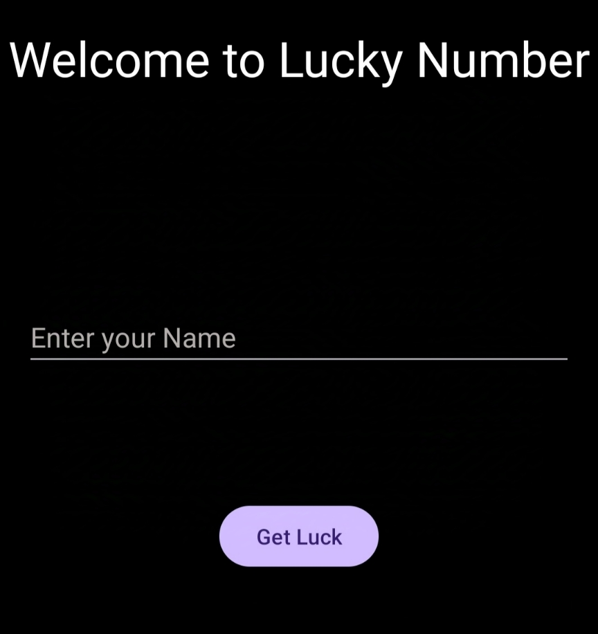

# Lucky Number Android Application


Welcome to the **Lucky Number**! This app allows users to generate and view their lucky numbers based on simple user inputs. The app is built using Android Studio and follows modern Android development practices.

## Features

- Simple and user-friendly interface.
- Generate a random lucky number based on user inputs.
- Option to share your lucky number with others.
- Dark mode support.
- Intuitive animations and transitions.

## Screenshots




## Installation

To run this project locally, follow these steps:

1. **Clone the repository**:
   ```bash
   git clone https://github.com/raghavg2004/Lucky-Number-Android-Application.git
   ```
2. Open the project in Android Studio
3. Build and Run
